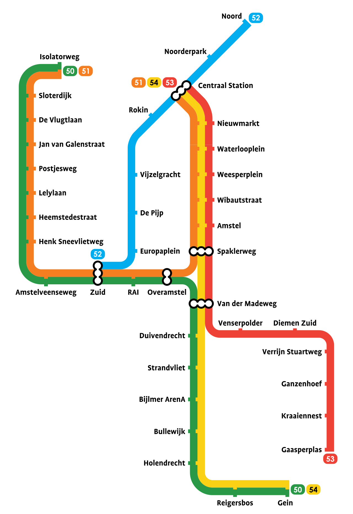

# Amsterdam Metro Challange

My attempt to solve a quite interesting challenge, put in our team's [Notion Page](https://www.notion.so/ycdev/Amsterdam-Metro-challenge-public-80444c8983b645118b8de600c91f620c) 😄. I'll just copy-paste the full challenge here:

We'd like you to design a system that lets us calculate the optimal cost of travel between two stations, with a tariff of 10 cents/stop. For example, the cost between **Noord** and **Centraal Station** is 20 cents (2 stops on the blue line). The cost between **Noord** and **Nieuwmarkt** is 30 cents (2 stops on the blue line, 1 stop on 51, 54 or 53)

Here are some aspects we'd like you to touch upon:

- How would we store the data? What kind of domain concepts do you see, how do they map to entities and what are the relationships between them?
- What is the first test you would write?
- If we introduce a cost to switching lines, how would that affect your design?
- The Bijlmer ArenA is an important business centre, so many people flock there at 9 in the morning. Do you think your design needs to be adjusted to allow for that? Why? If yes, how?
- Please ignore other aspects of the real-life scenario — trains, timetables, waiting time, etc.
